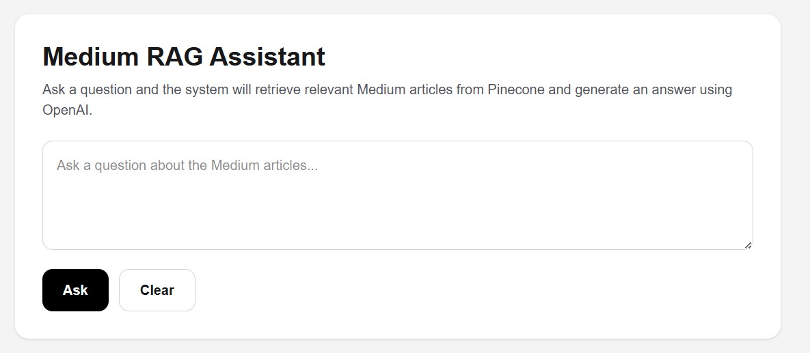
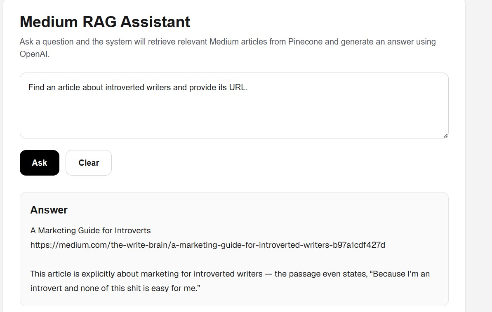
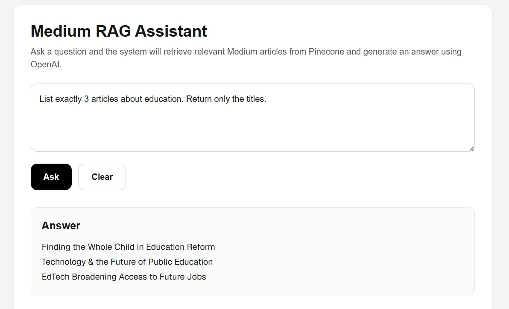
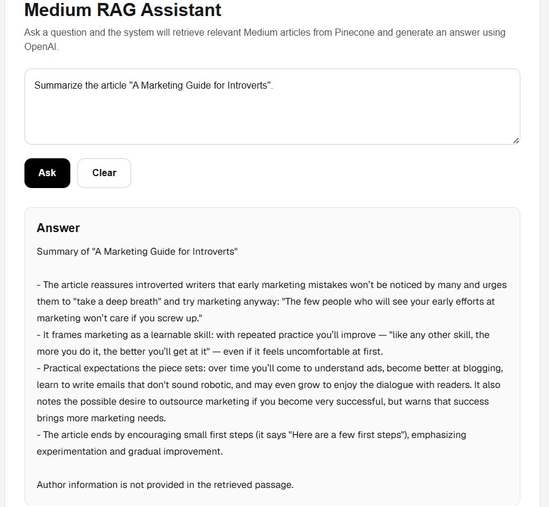
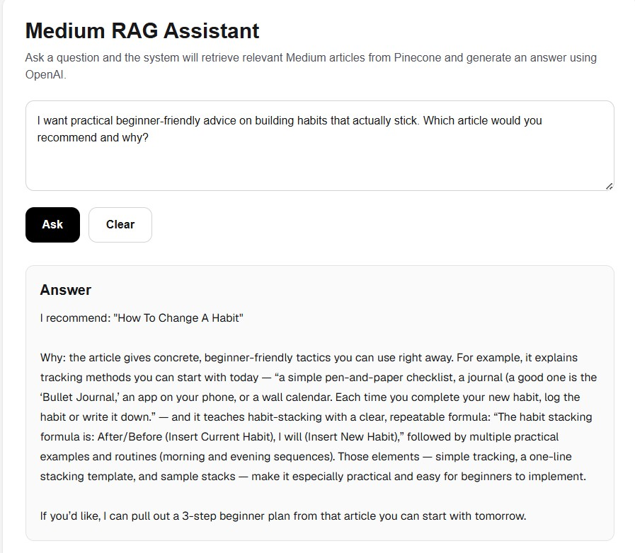
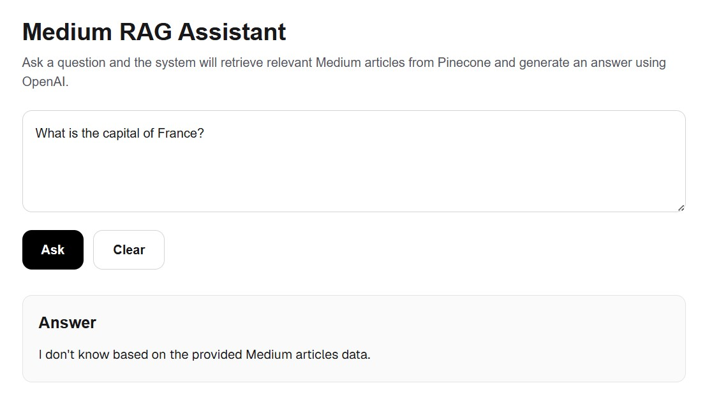

# Medium RAG Assistant

## AI Agent Systems (00960237)

**Faculty of Data and Decision Sciences**
**Technion – Israel Institute of Technology**
**Spring 2026**

---

## Project Overview

This project implements a Retrieval-Augmented Generation (RAG) system for answering questions over a collection of Medium articles.

The assistant combines semantic retrieval using vector embeddings with Large Language Model (LLM) generation. User questions are converted into embeddings, relevant article passages are retrieved from Pinecone, and GPT generates answers grounded exclusively in the retrieved dataset.

The system is specifically designed to minimize hallucinations and answer questions only from the provided Medium article corpus.

---

## Live Demo

https://medium-rag-assistant-nine.vercel.app/

---

## GitHub Repository

https://github.com/batelshuminov/medium-rag-assistant

---

## Assignment Goal

The objective of this assignment was to build a knowledgeable AI assistant specialized in Medium articles using a Retrieval-Augmented Generation (RAG) pipeline.

The assistant must:

* Answer questions only from the provided Medium dataset.
* Avoid using external knowledge.
* Retrieve relevant article passages.
* Generate grounded answers based on retrieved context.
* Support multiple query types defined in the assignment.

---

## System Architecture

The system follows the standard Retrieval-Augmented Generation workflow:

1. User submits a natural-language question.
2. OpenAI Embeddings convert the question into a vector.
3. Pinecone performs semantic similarity search.
4. Relevant article chunks are retrieved.
5. Retrieved passages are assembled into an augmented prompt.
6. GPT-5 Mini generates an answer using only the retrieved context.
7. The system returns:

   * Generated answer
   * Supporting article sources
   
   

---

## Technologies Used

* Next.js
* TypeScript
* OpenAI API
* Pinecone Vector Database
* Tailwind CSS
* Vercel

---

## Dataset

The system uses a dataset of approximately 7,600 English Medium articles.

Dataset schema:

* title
* text
* url
* authors
* timestamp
* tags

Dataset source:

https://drive.google.com/file/d/1Ew_jepAilAiYHG7_TUIHpBISYlwEtQQq/view

The dataset itself is intentionally excluded from the repository because of its size.

---

## Dataset Processing Pipeline

The ingestion process performs the following steps:

1. Load articles from CSV.
2. Split article text into overlapping chunks.
3. Generate embeddings using OpenAI.
4. Store vectors in Pinecone.
5. Attach metadata to each chunk.

Stored metadata:

* Article Title
* URL
* Authors
* Tags
* Timestamp

---

## RAG Hyperparameters

| Parameter       | Value |
| --------------- | ----- |
| Chunk Size      | 512   |
| Overlap Ratio   | 0.2   |
| Top-K Retrieval | 7     |

### Design Decisions

#### Chunk Size (512)

A chunk size of 512 was selected to balance retrieval precision and contextual coverage.

#### Overlap Ratio (20%)

A 20% overlap was used to reduce information loss at chunk boundaries.

#### Top-K (7)

Top-K retrieval was set to 7 to provide sufficient supporting evidence while avoiding excessive context size and token consumption.

---

## Cost-Efficient Development

A strict budget constraint of $5 was imposed for development and testing.

To comply with this requirement, the project followed an incremental development strategy:

1. The RAG pipeline was initially validated on a small subset of Medium articles.
2. Retrieval performance was evaluated before scaling to the full dataset.
3. Chunking hyperparameters were finalized prior to large-scale embedding generation.
4. Embeddings were generated only once for the final corpus configuration.
5. Unnecessary re-indexing and duplicate embedding operations were avoided.

The total API usage remained well below the assignment budget limit, demonstrating cost-efficient development while maintaining retrieval quality.

## Assignment Requirements Coverage

The system successfully supports all required query categories defined in the assignment.

| Requirement                                      | Supported |
| ------------------------------------------------ | --------- |
| Precise Fact Retrieval                           | ✅         |
| Multi-Result Topic Listing                       | ✅         |
| Key Idea Summary Extraction                      | ✅         |
| Recommendation with Evidence-Based Justification | ✅         |
| Grounded Question Answering                      | ✅         |
| Unknown Answer Detection                         | ✅         |
| Pinecone Vector Database                         | ✅         |
| Public Vercel Deployment                         | ✅         |
| POST /api/prompt Endpoint                        | ✅         |
| GET /api/stats Endpoint                          | ✅         |

---

## Core Functionality

### Semantic Retrieval

Questions are matched against article content using vector similarity search instead of keyword matching.

### Grounded Question Answering

Answers are generated only from retrieved article passages.

### Article Discovery

The assistant can locate specific articles and return metadata such as titles, URLs, and authors.

### Summarization

The system can summarize retrieved articles using only retrieved content.

### Recommendation

The assistant can recommend relevant articles and justify recommendations using evidence from retrieved passages.

### Unknown Answer Detection

When the dataset does not contain sufficient information, the assistant responds:

> I don't know based on the provided Medium articles data.

This prevents unsupported or hallucinated answers.

---

## API Endpoints

### POST /api/prompt

Queries the RAG system using a natural-language question.

Example:

```json
{
  "question": "Find an article about introverted writers and provide its URL."
}
```

Returns:

```json
{
  "response": "...",
  "sources": [...]
}
```

### GET /api/stats

Returns the active RAG configuration.

```json
{
  "chunk_size": 512,
  "overlap_ratio": 0.2,
  "top_k": 7
}
```

---

# Screenshots

## Main Interface



The deployed web application allows users to submit natural-language questions about the Medium article collection.

---

## Precise Fact Retrieval



Example query:

> Find an article about introverted writers and provide its URL.

The assistant successfully identifies a specific article and returns the corresponding URL.

---

## Multi-Result Topic Listing



Example query:

> List exactly 3 articles about education. Return only the titles.

The assistant retrieves multiple distinct articles while avoiding duplicate chunks from the same article.

---

## Key Idea Summary Extraction



Example query:

> Summarize the article "A Marketing Guide for Introverts".

The assistant generates a concise summary grounded entirely in retrieved article passages.

---

## Recommendation with Evidence-Based Justification



Example query:

> I want practical beginner-friendly advice on building habits that actually stick. Which article would you recommend and why?

The assistant recommends a relevant article and justifies the recommendation using retrieved evidence.

---

## Unknown Question Handling



Example query:

> What is the capital of France?

Since the answer is not contained in the Medium dataset, the assistant correctly refuses to answer and returns the predefined fallback response.

---

## Deployment

The application is publicly deployed on Vercel:

https://medium-rag-assistant-nine.vercel.app/

---

## Author

**Batel Shuminov**

M.Sc. Student in Electrical and Computer Engineering

Faculty of Data and Decision Sciences

Technion – Israel Institute of Technology

Spring 2026
